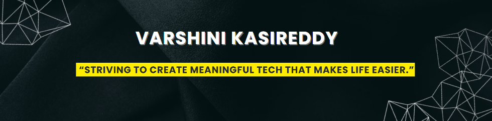

  <!-- Banner -->
  

  <!-- Typing Effect -->
  

  <!-- Followers -->
  
  <!-- Visitors -->
  

---

## ✨ About Me  

I’m **VARSHINI**, a Computer Science & IT undergraduate with a strong focus on **full-stack engineering, backend development, and cloud technologies**.  
I enjoy building **clean, scalable, and user-centric applications**—from intuitive frontends to secure, high-performance backends.

I’m currently sharpening my skills in **system design, distributed systems, API development, and production-grade application architecture**.  
I love working on projects that blend **creativity, problem-solving, and real-world impact**, and I’m always open to collaboration and new ideas.

> **I believe great engineering comes from clarity, consistency, and continuous learning.**

---

## 🔧 Skills & Tools

| 🎨 Frontend | ⚙️ Backend | 🚀 DevOps / Infra |
|------------|-----------|------------------|
|  |  |  |

| 🗄️ Databases | 🛠️ Tools & Platforms |
|--------------|----------------------|
|  |  |

---

## 🚀 Featured Projects

### 🔹 **Text2SQL Voice Assistant (Chatbot)**
A voice-enabled intelligent system that converts natural language queries into SQL statements and retrieves accurate results from a database.  
Handles speech processing, SQL generation, and clear result responses.

**Tech Stack:** Python, Flask, SQL, Speech-to-Text, OpenAI GPT-4o-mini (via OpenRouter for chat, direct OpenAI for audio)

**Highlights:** Real-time query conversion, chatbot-style responses

---

### 🔹 **Expense Tracker**
A full-stack application that allows users to track daily expenses with authentication, analytics, and a clean UI.  
Includes categories, visual charts, filtering, and secure data handling.

**New AI Feature: Receipt Auto-Scanning**

Automatically extracts expense details from uploaded receipts using OCR.
No need to type manually — the app reads the receipt and fills the fields for you.

**Tech Stack:** React,SpringBoot,MySQL, JWT Authentication,OCR (Tesseract / Google Vision API)

---

## 📊 GitHub Stats

  
  

  

---

## 🧠 LeetCode Stats  

Improving problem-solving skills through consistent DSA practice.

  

---

## 🌐 Let's Connect

  
  
  
  

---

> *“If you’d like to collaborate or discuss ideas, feel free to reach out.  
Let’s build something impactful — keep learning, keep growing.”*
